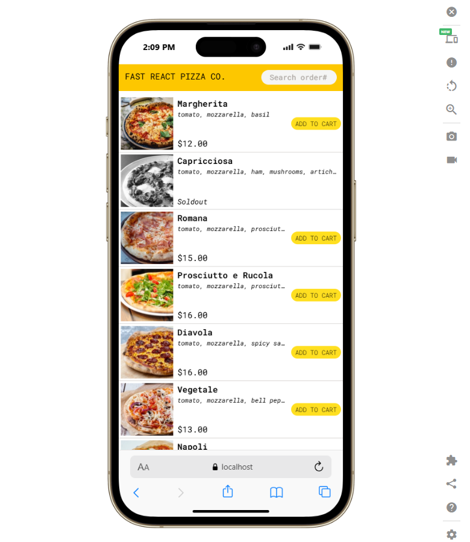
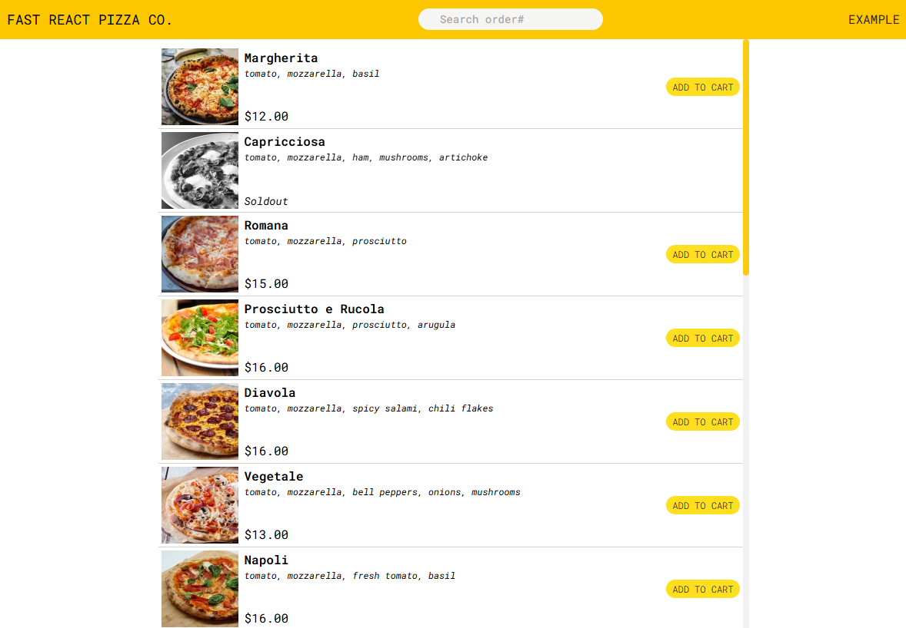

# 🍕 Fast React Pizza Co.

A modern and responsive pizza ordering web application built with React.  
Users can browse pizzas, customize their orders, manage their cart, place orders, and track order details.


🔗 **Live Demo**

[](https://fast-react-pizza-co-app-six.vercel.app/)

---
## 📸 Preview

<div align="center">



<br><br>



</div>
## ✨ Features

- 🍕 Browse pizza menu
- 🔍 Search orders using order ID
- 🛒 Add pizzas to cart
- ➕ Increase/decrease pizza quantity
- 🗑️ Remove items from cart
- 🧹 Clear entire cart
- 💰 Automatic order price calculation
- ⚡ Priority order option
- 📦 Create and manage orders
- 📍 Order status and estimated delivery time
- 🔄 Update order priority
- 🌐 Client-side routing
- 📱 Responsive design
- 🎨 Modern UI using Tailwind CSS
- 💾 Global state management using Redux Toolkit
- 📡 API integration for menu and orders
- 📍 Geolocation support for delivery location

---

## 🛠️ Tech Stack

### 🎨 Frontend


### 🔌 Backend / Data


### 🧰 Development Tools


## 🧠 React Concepts Used

This project was built to practice real-world React development concepts such as:

- Functional Components
- Props
- State Management
- `useState`
- `useEffect`
- `useSelector`
- `useDispatch`
- Redux Toolkit
- `createSlice`
- `configureStore`
- React Router
- Nested Routes
- Route Loaders
- Actions
- `useLoaderData`
- `useParams`
- `useFetcher`
- Form Actions
- Protected Routes
- API Requests
- Error Handling

---

## 🛒 Cart Management

Redux Toolkit is used to manage the shopping cart globally.

Cart functionality includes:

- Add item
- Remove item
- Increase quantity
- Decrease quantity
- Clear cart
- Calculate total quantity
- Calculate total price

---

## 📦 Order Management

Users can place orders by providing their details.

The application supports:

- Creating orders
- Viewing order details
- Searching orders
- Tracking order status
- Estimated delivery time
- Priority orders
- Updating order priority
- Calculating priority charges

---

## 🗺️ Routing

React Router is used for navigation and nested routing.

Example routes include:

```text
/
├── /menu
├── /cart
├── /order/new
├── /order/:orderId
└── /order/search
